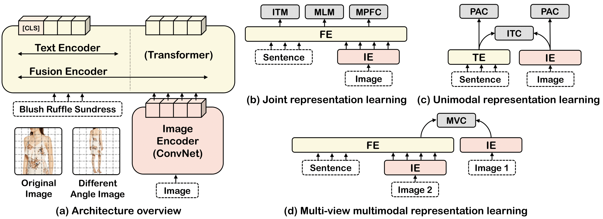

<div align="center">

# FashionViL: Fashion-Focused Vision-and-Language Representation Learning

<a href="https://pytorch.org/get-started/locally/"></a>
<a href="https://mmf.sh/"></a>
[](https://eccv2022.ecva.net/)
[](https://arxiv.org/abs/2207.08150)
[](https://www.shenlanxueyuan.com/open/course/167)
[](https://brandonhanx.github.io/files/0940.pdf)

</div>

## Updates

- :grin: (01/11/2022) Updated talk and poster.
- :relieved: (19/09/2022) Added detailed running instructions.
- :blush: (19/07/2022) Code released!

## Abstract

Large-scale Vision-and-Language (V+L) pre-training for representation learning has proven to be effective in boosting various downstream V+L tasks. However, when it comes to the fashion domain, existing V+L methods are inadequate as they overlook the unique characteristics of both fashion V+L data and downstream tasks.  In this work, we propose a novel *fashion-focused* V+L representation learning framework, dubbed as **FashionViL**. It contains two novel fashion-specific pre-training tasks designed particularly to exploit two intrinsic attributes with fashion V+L data.
First, in contrast to other domains where a V+L datum contains only a single image-text pair, there could be multiple images in the fashion domain.  We thus propose a Multi-View Contrastive Learning task for pulling closer the visual representation of one image to the compositional multimodal representation of another image+text. Second, fashion text (*e.g.*, product description) often contains rich fine-grained concepts (attributes/noun phrases). To capitalize this, a Pseudo-Attributes Classification task is introduced to encourage the learned unimodal (visual/textual) representations of the same concept to be adjacent. Further, fashion V+L tasks uniquely include ones that do not conform to the common one-stream or two-stream architectures (*e.g.*, text-guided image retrieval). We thus propose a flexible, versatile V+L model architecture consisting of a modality-agnostic Transformer so that it can be flexibly adapted to any downstream tasks.
Extensive experiments show that our FashionViL achieves new state of the art across five downstream tasks.

## Architecture



FashionViL consists of an image encoder, a text encoder and a fusion encoder. Text encoder and fusion encoder *share the same parameters*. We adopt six pre-training tasks for richer representation learning

## Getting started

:warning: *This implementation is based on [MMF](https://mmf.sh) (Meta AI's Modular Framework for Multimodal Research in Vision and Language). It is strongly recommended to read the [MMF documentation](https://mmf.sh/docs) before starting.*

### Dependencies installation

**Install MMF from source**

:warning: The latest PyTorch officially supported by MMF is 1.9.0. Feel free to upgrade if you need some features of a later version, but the mmf_cli commands (*e.g.*, mmf_run) will not be available.

```bash
conda create -n mmf python=3.7
conda activate mmf

git clone https://github.com/BrandonHanx/mmf.git
cd mmf
pip install --editable .
cd ..
```

**Install extra dependencies**

```bash
pip install wandb eniops
```

**(Optional) Log in W&B**

```bash
export WANDB_API_KEY=YOUR_KEY
```

**(Optional) Install lint hook if you want to make contribution**

```bash
pre-commit install .
```

### Data preparation

**Download datasets**

:warning: Please note that we do not own the copyrights of any datasets we used. We can only share the pre-processed caption data here via [Google Drive](https://drive.google.com/drive/folders/1rmSfvKcTvVLugBWFNFtIDZuQwRPGr87U?usp=sharing). Please contact the original authors to get access to the images.

**Download pre-trained models**

You can download our pre-trained VQVAE via [Google Drive](https://drive.google.com/file/d/11QKoXEG1NeFqUyLg4kOjkJTgQsiYHpdu/view?usp=sharing).

**Organise data directory as following**

:warning: The default location of data is in `./`. You can put it anywhere you like, but you need to specific its location via `env.data_dir=XXX` when calling MMF.

```bash
data
├── datasets
│   ├── BigFACAD
│   │   ├── images
│   │   ├── train_info.json
│   │   └── val_info.json
│   ├── Fashion200k
│   │   ├── images
│   │   ├── test_info.json
│   │   └── train_info.json
│   ├── FashionGen
│   │   ├── train
│   │   ├── train_info.json
│   │   ├── val
│   │   └── val_info.json
│   ├── FashionIQ
│   │   ├── captions
│   │   ├── images
│   │   └── image_splits
│   └── PolyvoreOutfits
│       ├── images
│       ├── ocir_disjoint_test.json
│       ├── ocir_disjoint_train.json
│       ├── ocir_nondisjoint_test.json
│       ├── ocir_nondisjoint_train.json
│       └── polyvore_item_metadata.json
└── pretrained_models
    └── vqvae_ema_pp_224_7x7_encoder_fashionall.pth
```

### Pre-training

Pre-train FashionViL (initialised from ResNet 50 and BERT-uncased-base) on four datasets with six pretext tasks:

```bash
python mmf_cli/run.py \
config=projects/fashionvil/configs/e2e_pretraining_final.yaml \
model=fashionvil \
dataset=fashionall
```

:star2: We used 4 x RTX 3090 to train this model. We provide the pre-trained [checkpoint](https://drive.google.com/file/d/1G_RyxQNbmkQDN6xUjP-IH2D22jW8bPz3/view?usp=sharing) via Google Drive in case you don't have enough GPU resources. After download, please put this model in `save/fashionvil_e2e_pretrain_final/fashionvil_final.pth`.

### Fine-tuning

Fine-tune pre-trained FashionViL on cross-modal retrieval on FashionGen:

```bash
python mmf_cli/run.py \
config=projects/fashionvil/configs/e2e_contrastive.yaml \
model=fashionvil \
dataset=fashiongen
```

Fine-tune pre-trained FashionViL on text-guided image retrieval on FashionIQ:

```bash
python mmf_cli/run.py \
config=projects/fashionvil/configs/e2e_composition.yaml \
model=fashionvil \
dataset=fashioniq
```

Fine-tune pre-trained FashionViL on sub-category classification on FashionGen:

```bash
python mmf_cli/run.py \
config=projects/fashionvil/configs/e2e_classification.yaml \
model=fashionvil \
dataset=fashiongen
```

Fine-tune pre-trained FashionViL on outfit complementary item retrieval on PolyvoreOutfits:

```bash
python mmf_cli/run.py \
config=projects/ocir/configs/polyvore/defaults.yaml \
model=csa_net \
dataset=polyvore_ocir
```


### Evaluation

Evaluate fine-tuned FashionViL on cross-modal retrieval on FashionGen:

```bash
python mmf_cli/run.py \
config=projects/fashionvil/configs/e2e_contrastive.yaml \
model=fashionvil \
dataset=fashiongen \
run_type=test \
checkpoint.resume_file=save/fashionvil_contrastive_fashiongen_e2e_pretrain_final/best.ckpt
```

Evaluate fine-tuned FashionViL on text-guided image retrieval on FashionIQ:

```bash
python mmf_cli/run.py \
config=projects/fashionvil/configs/e2e_composition.yaml \
model=fashionvil \
dataset=fashioniq \
run_type=test \
checkpoint.resume_file=save/fashionvil_composition_fashioniq_e2e_pretrain_final/best.ckpt
```

Evaluate fine-tuned FashionViL on sub-category classification on FashionGen:

```bash
python mmf_cli/run.py \
config=projects/fashionvil/configs/e2e_classification.yaml \
model=fashionvil \
dataset=fashiongen \
run_type=test \
checkpoint.resume_file=save/fashionvil_classification_fashiongen_e2e_sub/best.ckpt
```

Evaluate fine-tuned FashionViL on outfit complementary item retrieval on PolyvoreOutfits:

```bash
python mmf_cli/run.py \
config=projects/ocir/configs/polyvore/defaults.yaml \
model=csa_net \
dataset=polyvore_ocir \
run_type=test \
checkpoint.resume_file=save/polyvore_csa_disjoint_final/best.ckpt
```

## Citation

If you find this project useful for your research, please use the following BibTeX entry.

```
@inproceedings{han2022fashionvil,
  title={FashionViL: Fashion-Focused Vision-and-Language Representation Learning},
  author={Han, Xiao and Yu, Licheng and Zhu, Xiatian and Zhang, Li and Song, Yi-Zhe and Xiang, Tao},
  booktitle={ECCV},
  year={2022}
}
```
